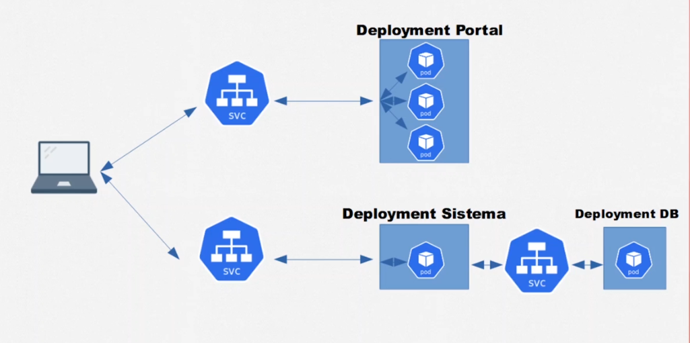
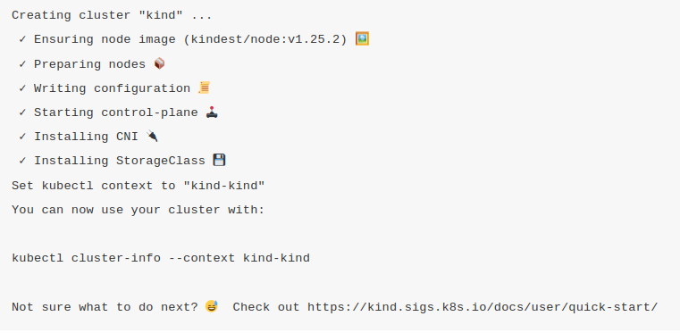
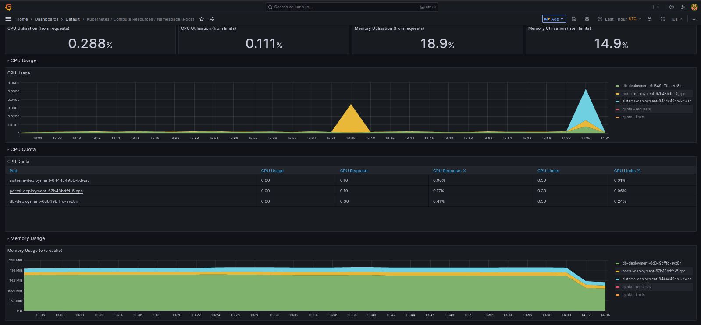
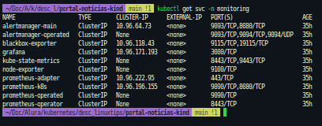

<p>
  
  
</p>

<h1 align="center">Projeto Alura Portal de noticias </h1>

### Curso de Kubernetes: Pods, Services e ConfigMaps

## 1 - Instalação.

### Kubectl

Kubernetes command-line tools(<a href="https://kubernetes.io/docs/tasks/tools/">kubectl</a>) permite executar comandos em seus clusters kubernetes

### Kind

<p>
  
</p>

<a href='https://kind.sigs.k8s.io/' target="_blank">Kind</a> kubernetes in Docker é uma ferramenta que permite executar clusters kubernetes num ambiente local utilizando docker.

```
curl -Lo ./kind https://kind.sigs.k8s.io/dl/v0.19.0/kind-linux-amd64

chmod +x ./kind

sudo mv ./kind /usr/local/bin/kind

```

## 2 - Criando cluster com multiplos nós com kind

`kind create cluster --name kind-multinodes --config ./kind-3nodes.yaml`

<p>
  
</p>

## 3 - Aplicando as configurações

- portal-configmap.yml - Alterar IP_SISTEMA para o INTERNAL_IP de um dos nós

`kubectl get nodes -o wide`

Criar os seguintes items nessa ordem:

```markdown
├── db-deployment.yml
├── db-noticias-configmap.yml
├── db-noticias-svc.yml
├── db-noticias.yml
├── portal-configmap.yml
├── portal-deployment.yml
├── portal-hpa.yml
├── portal-service.yml
├── sistema-noticias-configmap.yml
├── sistema-noticias-deployment.yml
├── sistema-noticias-service.yml
└── sistema-noticias.yml
```

`kubectl apply -f item`

## 4 - Acessando o Portal de Noticias

- Portal de Noticias - http://ip_node:30000
- Sistema Noticias - http://ip_node:30002

Acessar as URLs geradas no navegador

## 4 - Instalando kube-prometheus

<p>
  
  
</p>

kube-prometheus é uma ferramenta para monitorar os nossos clusters kubernetes.

```
git clone https://github.com/prometheus-operator/kube-prometheus.git
cd kube-prometheus
kubectl create -f manifests/setup
kubectl apply -f manifests/


```

Acessando o Prometheus e o Grafana Dashboard

- Verificar a porta dos serviços do prometheus e grafana

`kubectl get svc -n monitoring `

<p>
  
</p>

```
kubectl port-foward -n monitoring svc/prometheus-k8s 9090:9090
kubectl port-foward -n monitoring svc/grafana 3000:3000
```

<a href="https://github.com/prometheus-operator/kube-prometheus" target="_blank">Documentação</a>

## Autor

👤 **Marcus Vinicius**

- Github: [marcusjava](https://github.com/marcusjava)
