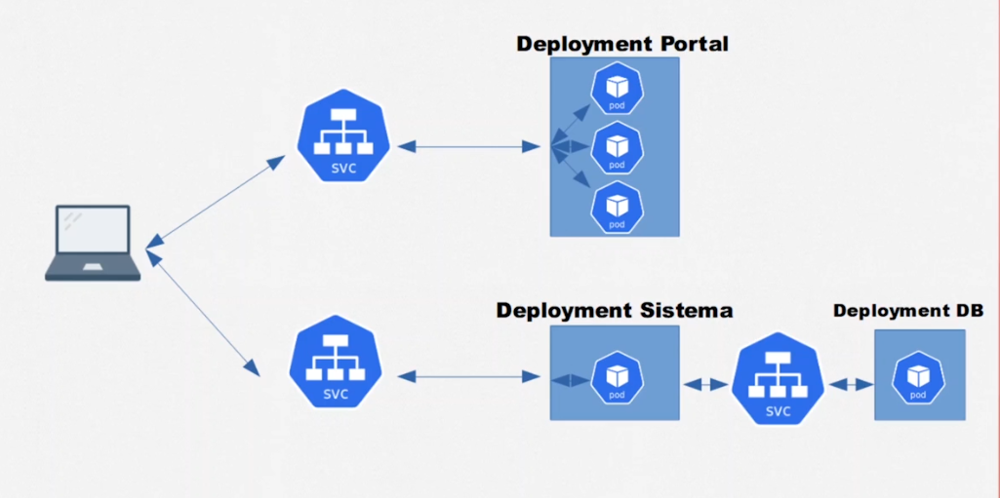
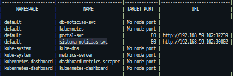
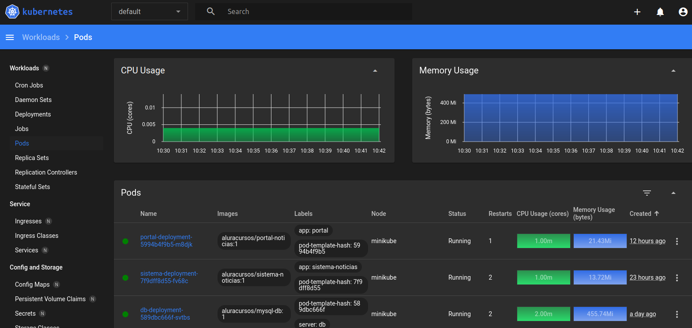

<p>
  
  
</p>

<h1 align="center">Alura cursos Projeto Portal de noticias </h1>

### Curso de Kubernetes: Pods, Services e ConfigMaps

## 1 - Instalação.

### Kubectl

Kubernetes command-line tools(<a href="https://kubernetes.io/docs/tasks/tools/">kubectl</a>) permite executar comandos em seus clusters kubernetes

### Minikube

<a href='https://minikube.sigs.k8s.io/docs/start/' target="_blank">Minikube</a> é uma ferramenta que facilita o aprendizado e desenvolvimento com kubernetes de fácil instalação.

## 2 - Iniciando o cluster

`minikube start --vm-driver=virtualbox`

<a href="https://minikube.sigs.k8s.io/docs/drivers/" target="_blank">Ver lista de drivers</a>

## 3 - Aplicando as configurações

- portal-configmap.yml - Alterar IP_SISTEMA para o IP externo do sistema noticias

Criar os seguintes items nessa ordem:

```markdown
├── db-noticias-configmap.yml
├── db-noticias-svc.yml
├── db-deployment.yml
├── portal-configmap.yml
├── portal-service.yml
├── portal-deployment.yml
├── portal-hpa.yml
├── sistema-noticias-configmap.yml
├── sistema-noticias-service.yml
├── sistema-noticias-deployment.yml
├── admin-dashboard.yml
├── cluster-admin.yml
```

`kubectl apply -f item`

## 4 - Acessando o Portal de Noticias

Para acessar o Portal e o Sistema de Noticias fora do cluster é necessario fazer as seguintes configurações:

`minikube service portal-svc --url`

`minikube sistema-noticias-svc --url`

`minikube service list`

<p>
  
  
</p>

Acessar as URLs geradas no navegador

## 4 - Acessando o Kubernetes Dashboard

<p>
  
  
</p>

Kubernetes Dashboard é ferramenta web onde é possível criar e modificar recursos como Deployments, Jobs, Services, verificar de forma visual consumo de CPU e memoria e monitorar o estado dos pods

<a href="https://kubernetes.io/docs/tasks/access-application-cluster/web-ui-dashboard/" target="_blank">Documentação</a>

## Autor

👤 **Marcus Vinicius**

- Github: [marcusjava](https://github.com/marcusjava)
